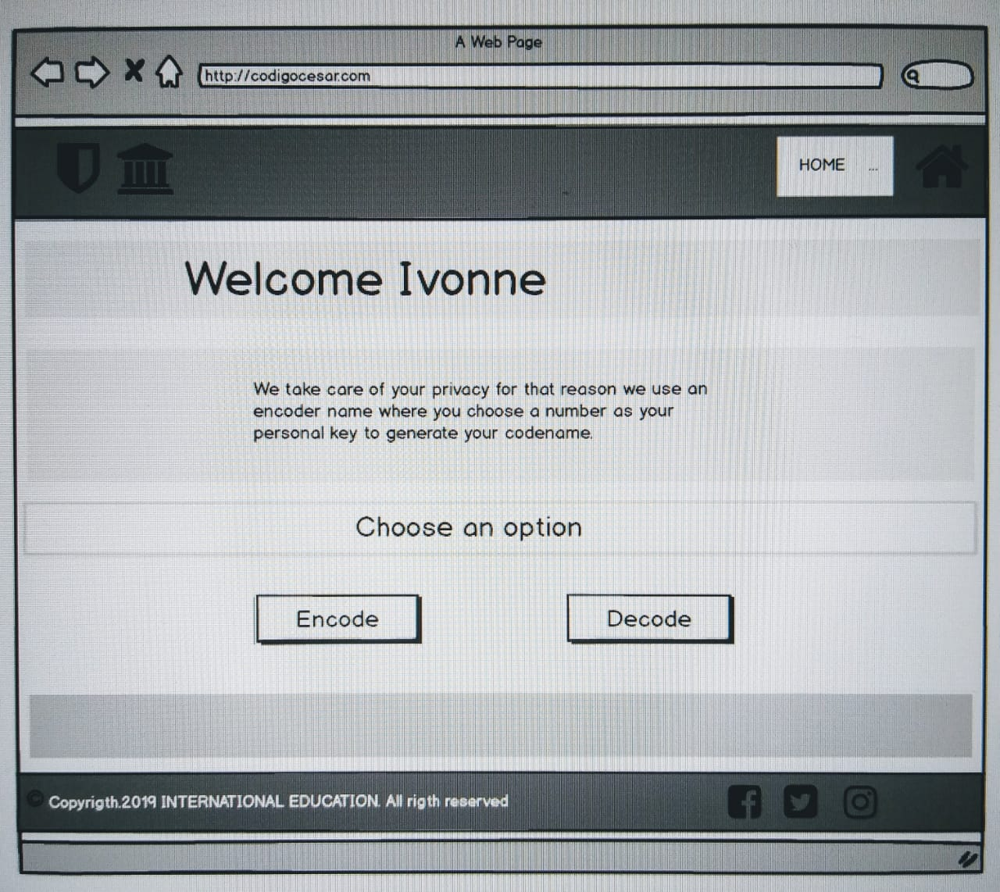

# SECURE ENROLLMENT SYSTEM

### Esta es una página web para alumnos que van a matricularse con la opción de poder ocultar su nombre por uno secreto.

**Los usuarios** son **un grupo de estudiantes** que al matricularse en sus cursos no desean que sus datos se publiquen por ello se les da la opción de encriptar su nombre por uno secreto.

**El objetivo** es resolver este problema de privacidad y la elección de cursos que haga el alumno o la cantidad de veces que este lo desee llevar, **dándole seguridad y confianza** al usuario al momento de matricularse **sabiendo que sus datos se mantienen en reserva** y que únicamente el es dueño de su codigo de identidad.

#### * Imagen final del proyecto.

### Decisiones de diseño.

**El diseño** de la pagina fue pensado en un **color que brinde seguridad, profesionalismo y confianza,** mi eleccion fue el **azul** como principal seguido de colores neutros como plomo, negro y blanco.
Para mi diseño coloque como **imagen de fondo un grupo de estudiantes** en clase y el **escudo de una institucion,** este logo puede cambiar dependiendo del centro educativo.

#### * Imagen del Diagrama de flujo.

#### * Imagen del primer prototipo en papel.

#### * Resumen del feedback recibido indicando las mejoras a realizar.

En mi **feedback** lo que me indicaron fue hacer mi pagina mas dinamica y de facil acceso haciendo que **en solo una pagina se incluya mi funcion principal de cifrar y descifrar** para que el usuario no se aburra del proceso.

Ademas de asignarle enlaces a mi **boton home** para volver al inicio y a los logos de redes las sociales.

#### * Imagen del prototipo final en Balsamiq.

